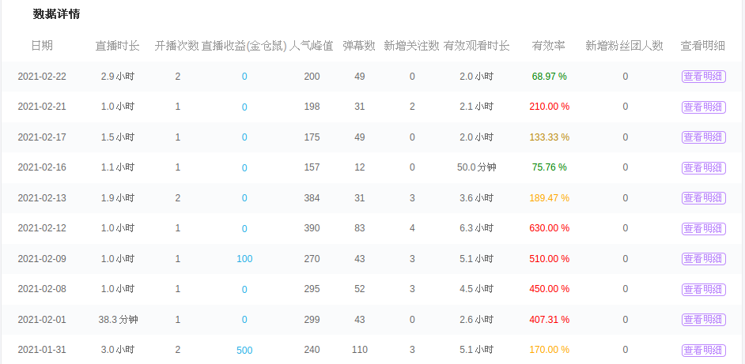
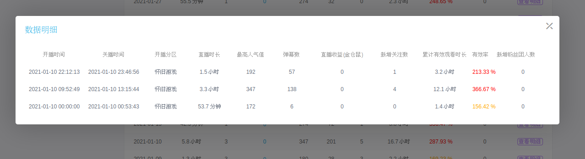

# bilibili-live-effective-rate

**effective-watching-time** / **live-duration** = **live-effective-rate**

[简体中文 README](README_zh-cmn-Hans.md)

Greasy Fork: https://greasyfork.org/zh-CN/scripts/421252-bilibili-live-effective-rate

I'm lazy to write the English version of README.

This project is licensed under **GNU AFFERO GENERAL PUBLIC LICENSE Version 3**
